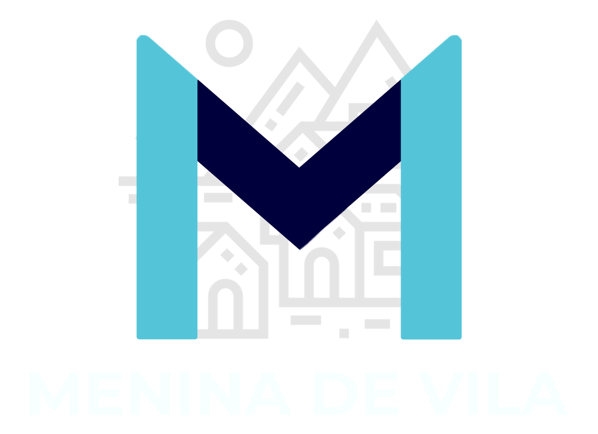
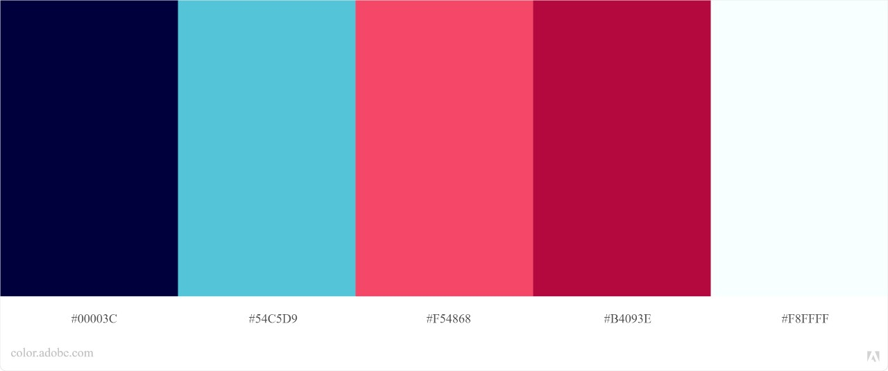
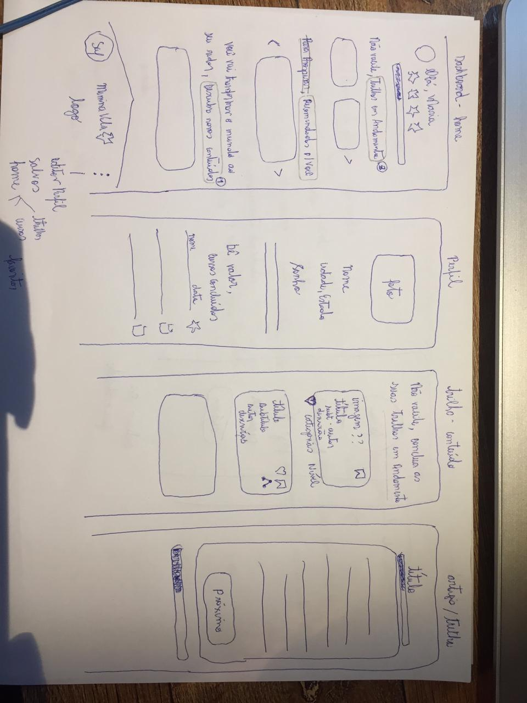
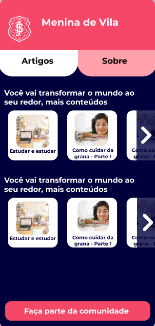
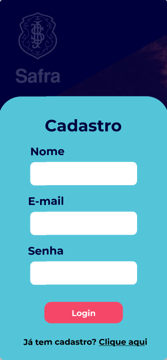
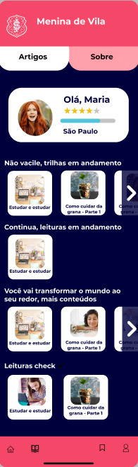
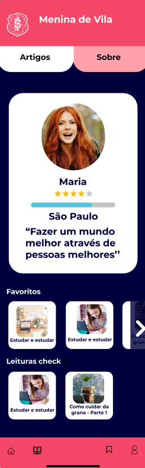
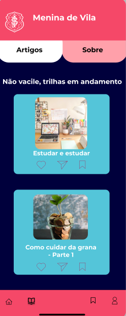
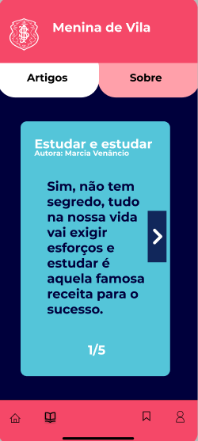

<h1 align="center"> Menina de Vila :girl: - Banco Safra </h1>

<div align="center">
  
</div>

<h2 align="center"> Projeto Final desenvolvido no hackathon do Talent Fest durante o bootcamp de Front-End da SAP006 Laboratoria :yellow_heart: </h2>

## Índice

1. [A Ideia](#dart-a-ideia)
2. [Desafio](#on-desafio)
3. [Objetivos Principais](#pencil2-objetivos-principais)
4. [UX/UI Design](#art-uxui-design)
5. [Tecnologias Utilizadas](#robot-tecnologias-utilizadas)
6. [Estrutura dos Principais Arquivos](#file_folder-estrutura-dos-principais-arquivos)
7. [Resultados](#%EF%B8%8F-resultados)
8. [Sobre as desenvolvedoras](#woman_technologist-sobre-as-desenvolvedoras)

---
## :dart: A Ideia
O Projeto “**Menina de Vila – O Portal de Educação Financeira e Investimentos. Criado por, e para, Mulheres**” tem como principal objetivo, simplificar a linguagem do mercado financeiro e levar conteúdo de educação financeira para as meninas que não possuem acesso as informações na linguagem da periferia.

<div align="center" style="display: flex">
    
</div>

---
## :on: Desafio
* Layout / Design da plataforma e dos “cards” de estudo
* Trilha de estudo
* Dashboard com informações sobre avanço
* Notificações para manter o engajamento dos estudos
* Like nos artigos e compartilhamento

---

## :pencil2: Objetivos Principais
* Gerar conhecimento sobre educação financeira e investimento
* Ter uma linguagem simples
* Atingir o publico feminino das periferias
* Gerar engajamento nas comunidades

---
## :art: UX/UI Design

### Paleta de Cores 


---

### Protótipo de Baixa Fidalidade
<div align="center" style="display: flex">
  
</div>

### Protótipo de Alta Fidelidade
<div align="center" style="display: flex">
  
  <br><br>
  
  <br><br>
  
  
  
  <br><br>
</div>

---

## :robot: Tecnologias Utilizadas

| Ferramenta | Descrição |
| --- | --- |
| `React` | Biblioteca JavaScript para criar interfaces de usuário |
| `HTML 5` | Linguagem de marcação |
| `CSS` | Linguagem de estilização |
| Bootstrap | Framework para desenvolvimento de componentes de interfaces front-end |
| `JavaScript` |  Linguagem de programação interpretada estruturada |
| `Node.js` | Software de execução de códigos JavaScript |
| `Git e GitHub` | Sistemas de controle de versões distribuídos |
| `Figma` | Editor gráfico de vetor e prototipagem de projetos |

---

## :file_folder: Estrutura dos Principais Arquivos
```
.
├── 📁public
|
├── 📁src
|   |
|   ├── 📁assets
|   |
|   ├── 📁components
|   |   ├── 📁Button
|   |   ├── 📁Card
|   |   ├── 📁Carousel
|   |   ├── 📁FlipCard
|   |   ├── 📁Header
|   |   ├── 📁Input
|   |   ├── 📁Modal
|   |   └── 📁Navbar 
|   |
|   ├── 📁pages
|   |   ├── 📁About
|   |   ├── 📁Article
|   |   ├── 📁Contents
|   |   ├── 📁Home
|   |   ├── 📁Login
|   |   ├── 📁Notfound
|   |   └── 📁Profile
|   |
|   ├── 📁routes
|   |
|   ├── 📁services 
|   |
|   ├── 📄global.css
|   └── 📄index.js
|   
├── 📄README.md
└── 📄package.json

```

## ✔️ Resultados

<div style="display: flex" align="center">
  <br><br>
  <br><br>
  <br><br>
  
</div>

---

## :woman_technologist: Sobre as Desenvolvedoras

* ### [Carmen Gozza](https://www.linkedin.com/in/carmen-emilia-gozza/)

* ### [Jennifer Pessoa](https://www.linkedin.com/in/jennifer-pessoa/)

* ### [Jéssica Inamassu](https://www.linkedin.com/in/jessica-inamassu/)

* ### [Joice Souza](https://www.linkedin.com/in/joicesouza-/)

* ### [Juliete Andrade](https://www.linkedin.com/in/juliete-andrade-1990/)

* ### [Patrícia Barnabé](https://www.linkedin.com/in/patriciabarnabe)

